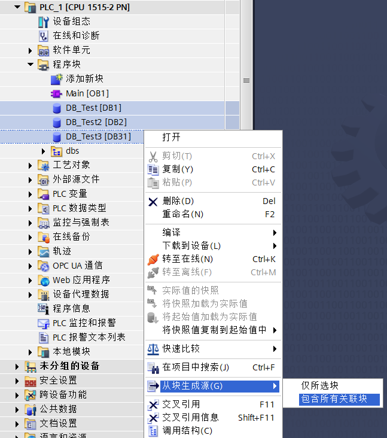
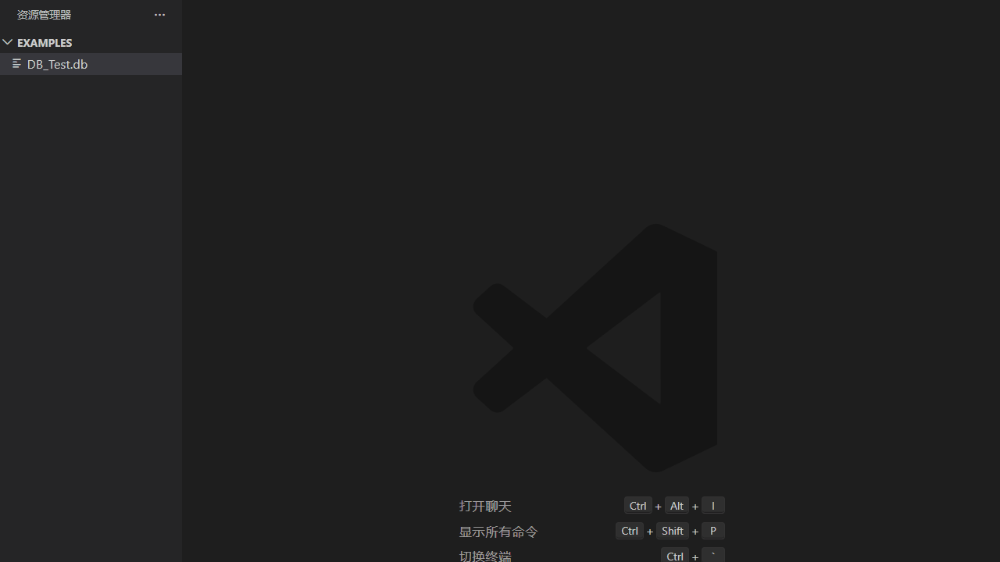
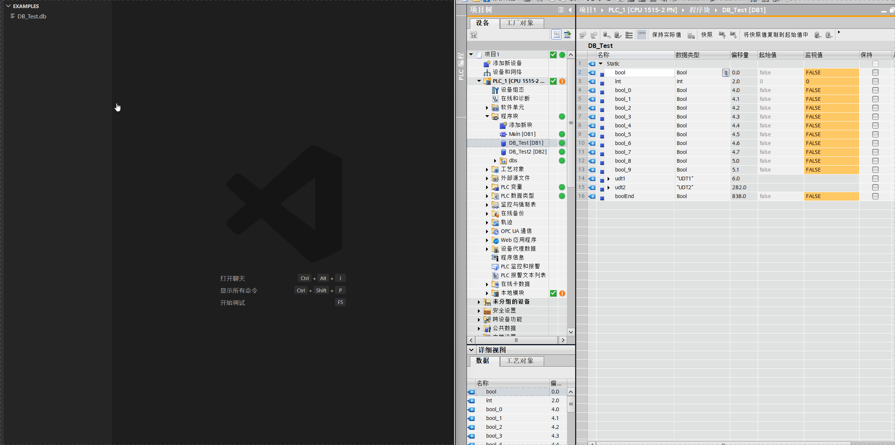

# S7 DB Monitor

English | [简体中文](README.zh-CN.md)

S7 DB Monitor is a VS Code extension for monitoring Siemens S7 PLC DB blocks from TIA Portal exported `.db` source files. It opens `.db` files as a custom monitor view, parses the DB layout, reads DB bytes through the S7 protocol and decodes variable values locally.

## Support Notice

This project is provided as-is. The project does not provide technical support, troubleshooting, customization, maintenance, warranty or service commitments. Users are responsible for evaluating risks before using it with PLC devices.

## Features

- Open TIA Portal exported `.db` files directly as a monitoring view.
- Parse one or more `DATA_BLOCK` declarations from the same file.
- Parse same-file PLC data types (`TYPE "UDT"`), arrays and nested structures.
- Display DB variables in a collapsible tree table similar to TIA Portal.
- Use a left DB block list for files that contain many DB blocks.
- Set actual PLC DB block numbers when exported files do not include block numbers.
- Remember connection parameters and DB block numbers per `.db` file in the current VS Code workspace.
- Read only the selected DB block once or continuously.
- Read a full DB byte range and decode values locally by variable address and type.

## PLC Requirements

Before connecting to a PLC, make sure the PLC and DB blocks allow S7 DB access:

- The PLC must be reachable from the computer running VS Code.
- TCP port `102` must be reachable.
- For S7-1200/S7-1500, enable full access and PUT/GET access in CPU protection settings.
- Use global DBs with optimized block access disabled.
- Download the matching DB to the PLC, then export the `.db` source from TIA Portal.

See [docs/plc-setup.md](https://github.com/lizhuanshu/vscode-s7-db-monitor/blob/main/docs/plc-setup.md) for the full PLC setup guide.

## Use The Monitor

1. Open a TIA Portal exported `.db` file in VS Code.
2. If the file contains multiple DB blocks, select the DB block from the left list.
3. If the exported file does not contain the actual PLC DB number, enter it in the left DB block list.
4. Enter the PLC IP, rack, slot and read cycle in the title bar.
5. Click `Connect`.
6. Use `Read Once` for a single read or `Continuous` for cyclic reads of the selected DB block.

The left DB block list can be resized by dragging the divider.

## Saved Parameters

The extension remembers these values per `.db` file in the current VS Code workspace:

- PLC connection options
- manually entered DB block numbers

Project files are not modified.

## Supported Data

- Binary numbers: `Bool`, `Byte`, `Word`, `DWord`, `LWord`
- Integers: `SInt`, `Int`, `DInt`, `USInt`, `UInt`, `UDInt`, `LInt`, `ULInt`
- Floating point: `Real`, `LReal`
- Date and time: `Date`, `Time`, `TOD`, `LTOD`, `DT`, `LDT`, `DTL`
- Strings: `Char`, `WChar`, `String[n]`, `WString[n]`
- PLC data types: same-file `UDT` definitions

See [docs/tia-supported-data-types.md](https://github.com/lizhuanshu/vscode-s7-db-monitor/blob/main/docs/tia-supported-data-types.md) for details.

## Commands And Settings

- `S7 DB Monitor: Open Monitor`: opens an empty monitor panel.
- `S7 DB Monitor: Open DB File`: opens the selected `.db` file in the monitor.
- Explorer context menu for `.db` files: opens the file with S7 DB Monitor.
- `s7DbMonitor.defaultHost`: default PLC IP address. Default: `192.168.0.1`.
- `s7DbMonitor.defaultRack`: default S7 rack number. Default: `0`.
- `s7DbMonitor.defaultSlot`: default S7 slot number. Default: `1`.
- `s7DbMonitor.pollIntervalMs`: default continuous read interval in milliseconds. Default: `1000`.

## Troubleshooting

- Connection fails: check PLC IP, rack, slot, network route and port `102`.
- S7-1200/S7-1500 cannot be read: check full access, PUT/GET access and optimized block access.
- Values are empty or incorrect: make sure the PLC DB matches the exported `.db` file.
- The monitor asks for a DB number: enter the actual PLC DB number in the left DB list.
- External UDT files are not resolved yet; keep UDT definitions in the same exported file when possible.
- Write operations are not implemented yet.

## More Documents

- [PLC setup](https://github.com/lizhuanshu/vscode-s7-db-monitor/blob/main/docs/plc-setup.md)
- [Supported TIA Portal data types](https://github.com/lizhuanshu/vscode-s7-db-monitor/blob/main/docs/tia-supported-data-types.md)
- [Development guide](https://github.com/lizhuanshu/vscode-s7-db-monitor/blob/main/docs/development.md)

## Repository

GitHub: <https://github.com/lizhuanshu/vscode-s7-db-monitor>

## Company

  
  
<strong>AgainDo</strong>

## License

MIT © liming
